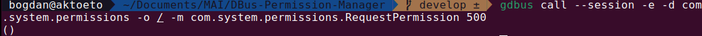
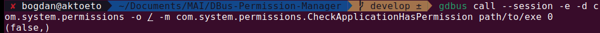
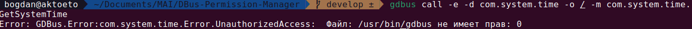
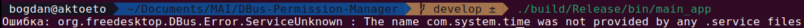
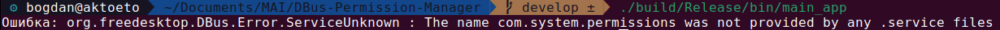
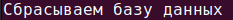
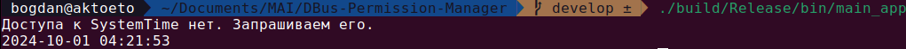
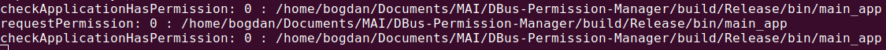
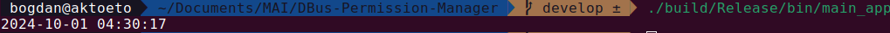

# DBus permission manager

## Описание

### Библиотеки
[](https://conan.io/center/recipes/sqlite3)
[](https://conan.io/center/recipes/sdbus-cpp)

### Концепция
В популярных мобильных ОС присутствует динамическое управление разрешениями. Один из способов его реализации - централизованный
сервис, у которого стороннее приложение может запросить какое-либо разрешение, а другой сервис может узнать, запрашивало ли приложение,
которое к нему обращается, определенный вид разрешения.

### Необходимо

1. Реализовать DBus сервис с именем com.system.permissions на сессионной шине с использованием языка C++, который имеет 2
метода:
- `void RequestPermission(permissionEnumCode: int)`
Который получает путь до исполняемого файла, вызвавшего данный метод, по dbus имени клиента и сохраняет в базу данных SQLite информацию о том, что данный исполняемый файла запросил заданное
разрешение. В случае ошибки метод должен возвращать DBus ошибку с человекочитаемым сообщением.
- `bool CheckApplicationHasPermission(applicationExecPath: String, permissionEnumCode: int)`
Который проверяет имеется ли у приложение с заданным путем до исполняемого файла заданное разрешение. В случае
ошибки метод должен возвращать DBus ошибку с человекочитаемым сообщением.

    **Перечисление разрешений:**
`enum Permissions { SystemTime = 0 }`

    **Пример использования:**
- `gdbus send -e -d com.system.permissions -o / -m com.system.permissions.RequestPermission 0`
- `gdbus send -e -d com.system.permissions -o / -m com.system.permissions.CheckApplicationHasPermission /usr/bin/com.example.example 0`
2. Реализовать DBus сервис `com.system.time` на сессионной шине с использованием языка C++, который имеет 1 метод:
- `uint64 GetSystemTime()`
Который возврашает `timestamp` текущего системного времени. Однако перед этим, он получает путь до исполняемого файла,
вызвавшего данный метод, по dbus имени клиента и проверяет при помощи DBus сервиса com.
`system.permissions`, имеет ли данный исполняемый файл разрешение `SystemTime`. В случае если исполняемый файл не
имеет разрешения `SystemTime`, должна возвращаться ошибка `UnauthorizedAccess` с человекочитаемым сообщением. В
случае любой другой ошибки должна возвращаться обычная ошибка с человекочитаемым сообщением.
- Пример использования:
`gdbus send -e -d com.system.time -o / -m com.system.time.GetSystemTime`
3. Реализовать приложение с использованием языка C++, которое:
- Пробует запросить у сервиса `com.system.time` текущее время и в случае ошибки `UnauthorizedAccess` запрашивает
разрешение `SystemTime` у сервиса `com.system.permissions`, после чего пытается повторить запрос текущего времени.
- После получения `timestamp`a текущего времени, выводит его на экран в человекочитемом виде.

## Сборка

> ### **gcc должен быть не меньше 10 версии**

### **Установка с использованием скриптов**

1. Склонировать репозиторий и перейти в папку с репозиторием:
```
git clone https://github.com/AKTOETO/DBus-Permission-Manager.git
cd DBus-Permission-Manager/
```
2. Выдать права на исполнение трем скриптам
```
chmod +x initial-conf.sh compile-debug.sh compile-release.sh 
```
3. Запустить скрипт `initial-conf.sh` для начальной настройки репозитория (установки cmake и conan; создание профиля в conan; загрузки нужных библиотек через conan; создание папки `build` для бинарников). 
> Если запустить `initial-conf.sh` без параметров, то проект будет конфигурироваться под тип сборки `Release` (от этого будет зависеть следующий запускаемый скрипт). Если нужна конкретная сборка (всего типа два: `Debug`; `Release`), то нужно передать тип сборки в скрипт.
```
./initial-conf.sh
```
4. Запускаем скрипт `compile-release.sh`, который сконфигурирует проект через `cmake` в соответствии с текущим типом сборки (на предыдущем шаге говорилось про тип сборки) и скомпилирует все необходимые таргеты.
```
./compile-release.sh
```
> Если нужен тип сборки `Debug`, то вызываем скрипт `compile-debug.sh`
5. Получили 3 исполняемых файла:
```
./build/Release/bin/main_app
./build/Release/bin/permission_server
./build/Release/bin/time_server
```

Полный набор команд:
```
git clone https://github.com/AKTOETO/DBus-Permission-Manager.git &&
cd DBus-Permission-Manager/ &&
chmod +x initial-conf.sh compile-debug.sh compile-release.sh &&
./initial-conf.sh &&
./compile-release.sh
```

### **Установка без скриптов**
1. Склонировать репозиторий и перейти в папку с репозиторием:
```
git clone https://github.com/AKTOETO/DBus-Permission-Manager.git
cd DBus-Permission-Manager/
```
2. Установить `conan` и `cmake`
```
pip install conan cmake
```
3. Чтобы `conan` смог собрать все библиотеки под текущую конфигурацию системы, нужно создать профиль для него.
```
conan profile detect --force
```
4. Создадим папку для сборки проекта:
```
mkdir -p build
```
5. Запсускаем сборку пакетов `conan`. `Release` можно заменить на `Debug`, тогда `conan` установит пакеты для `Debug` сборки проекта:
```
conan install . --settings=build_type=Release --build=missing
```
6. Теперь, используя готовый пресет конфигурации проекта, который был получен на предыдущем шаге, можно запустить саму конфигурацию проекта с помощью `cmake`:
```
cmake --preset=conan-release
```
> Если бы на 6ом шаге выбрали `Debug`, тогда надо было бы использовать команду `cmake --preset=conan-debug` для конфигурации проекта
7. В конце необходимо все скомпилировать:
```
cmake --build build/Release/
```
> Если раньше выбирали `Debug`, то надо использовать команду `cmake --build build/Debug/`


## Тестирование
В задании дана команда: 
```
gdbus send -e -d com.system.permissions -o / -m com.system.permissions.RequestPermission 0
```
Вместо нее используется:
```
gdbus call -e -d com.system.permissions -o / -m com.system.permissions.RequestPermission 0
```

### Пример использования:


Аналогично с командой:
```
gdbus send -e -d com.system.permissions -o / -m com.system.permissions.CheckApplicationHasPermission
/usr/bin/com.example.example 0
```
Которая заменена на:
```
gdbus call -e -d com.system.permissions -o / -m com.system.permissions.CheckApplicationHasPermission path/to/exe 0
```
### Пример использования:


Также с командой:
```
gdbus send -e -d com.system.time -o / -m com.system.time.GetSystemTime
```
Которая приняла вид:
```
gdbus call -e -d com.system.time -o / -m com.system.time.GetSystemTime
```



## Использование
После [сборки](#сборка) появились исполняемые файлы в директории: `build/Release/bin/`.
Для тестирования всей системы необходимо запустить два серверных процесса, а именно: `permission_server` и `time_server`. После чего необходимо запустить `main_app`. 
> Если запустить сначала `main_app`, а потом сервисы, то получится ошибка: 


> Если же запустить `time_server`, а потом `main_app`, то также выйдет ошибка, но уже другого типа:


> Сервис `permission_server` можно запустить со сбросом базы данных следующим образом: `./permission_server -c`. Выведется соответствующее сообщение:


После запуска двух серверных процессов запускаем `main_app` и видим:


Такое сообщение говорит о том, что у программы не было права `SystemTime`, из-за чего она была вынуждена его запросить и, после получения этого доступа, снова обратиться к сервису `com.system.time` к методу `GetSystemTime` для получения системного времени. При этом на стороне сервиса `permission_server` можно заметить следующие логи:


Тут как раз все видно:
1. Процесс узнал имеет ли он доступ **(не имеет)**
2. Процесс запросил доступ
3. Процесс снова проверил имеет ли доступ **(имеет)**

Если же запустим `main_app` еще раз, уже увидим следующее:


Видно, что сообщение `Доступа к SystemTime нет. Запрашиваем его.` пропало. Это произошло потому, что в базе данных сохранилась запись о том, что это приложение уже имеет эти права доступа.
